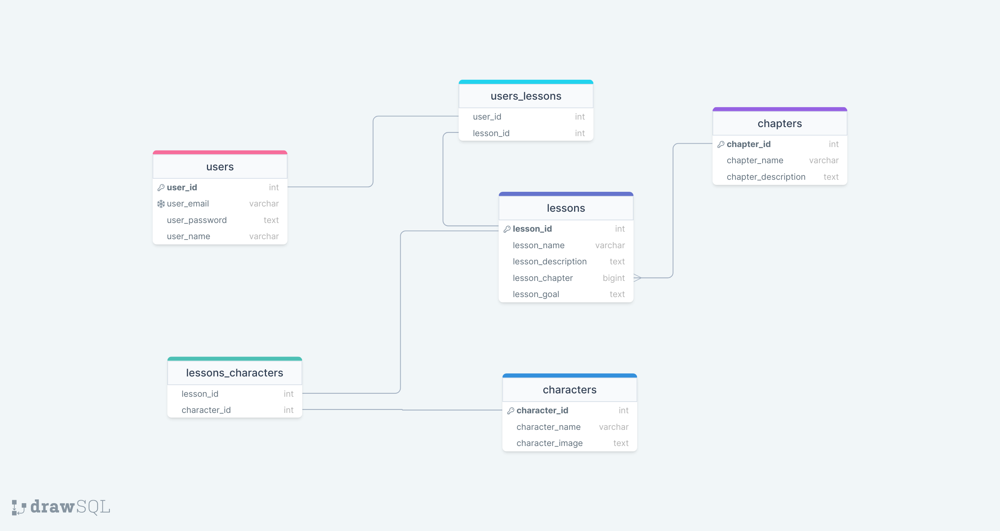
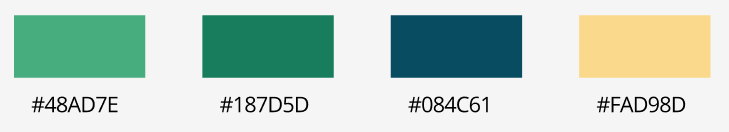

# Spécification techniques
## Base de données
- Utilsation d'une base de données MySQL

Schema : [lien direct](https://drawsql.app/teams/ds-team/diagrams/madumaja) ou

## API
But : communication entre client et base de données

## Client
- Utilisation de ReactJS pour le dynamisme des pages
- TailwindCSS pour la facilité et la rapidité de stylisation
- Redux pour la centralisation des données

### Choix graphiques
#### Couleurs

#### Polices
- Titres : Unbounded
- Corps de texte : Open Sans